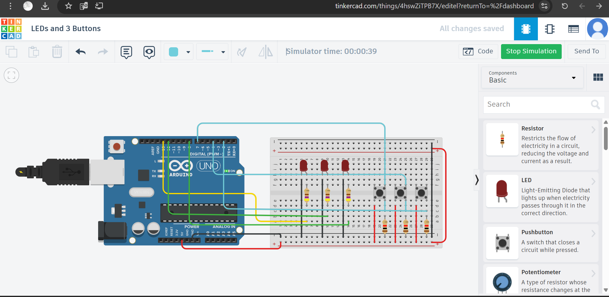
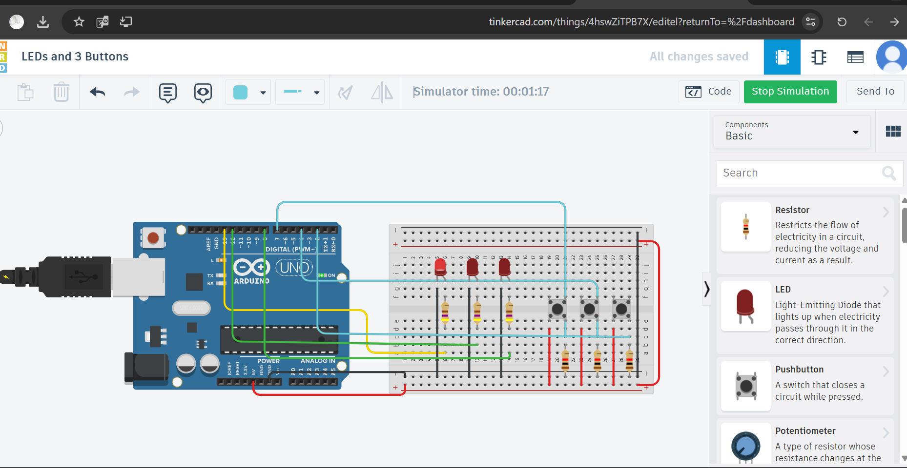
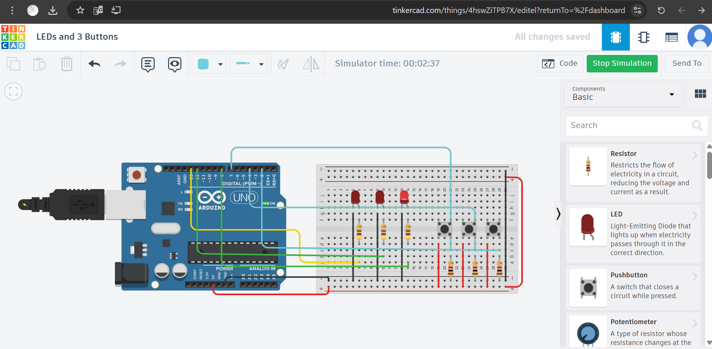

# 🎇 LEDs and 3 Buttons – Arduino Project

## 👩🏻‍💻 Designer  
*Designed by:* Abeer Alasmri  
*Platform:* Tinkercad  
*Specialization:* Electrical & Electronics  
*Program:* Smart Methods – Summer Training 2025

---

## 🎯 Project Description  
This project uses an Arduino Uno board to control three LEDs using three push buttons.  
Each button controls one LED: when the button is pressed, its LED turns ON for 3 seconds and then OFF.  
Only one LED can be active at a time due to the else if structure in the code.

---

## 🧰 Components Used

- Arduino Uno board  
- 3 LEDs (Red)  
- 3 Push Buttons  
- 3 Resistors (470Ω) for LEDs  
- 3 Resistors (10kΩ) as pull-down resistors for buttons  
- Breadboard  
- Jumper wires (Red, Black, Yellow, Green, Cyan)  
- 2 power rail jumpers (5V and GND)

---

## 🔌 Circuit Wiring

- 🔌 *LED Connections*
  - Anodes (long legs) → Arduino pins: 13, 12, 8  
  - Cathodes (short legs) → GND via 470Ω resistors  

- 🔘 *Button Connections*
  - One side of each button → Arduino pins: 7, 4, 2  
  - Other side → 5V  
  - Pull-down resistor (10kΩ) connects Arduino pins to GND  

- 🔁 *Power Rails*
  - 🔴 Red jumper connects 5V rail sides  
  - ⚫ Black jumper connects GND rail sides

---

## 🎨 Wire Color Guide

| Color            | Function                            |
|------------------|-------------------------------------|
| 🔴 Red           | 5V (Power) – VCC to buttons          |
| ⚫ Black         | GND – Common ground for all         |
| 🟢 Green         | Signal wires for LED 1 & LED 2      |
| 🟡 Yellow        | Signal wire for LED 3               |
| 🔵 Cyan          | Signal wires from buttons to Arduino pins |

---

## 💻 Arduino Code

```cpp
void setup()
{
  pinMode(7, INPUT);     // Button 1 input
  pinMode(4, INPUT);     // Button 2 input
  pinMode(2, INPUT);     // Button 3 input

  pinMode(13, OUTPUT);   // LED 1 output
  pinMode(12, OUTPUT);   // LED 2 output
  pinMode(8, OUTPUT);    // LED 3 output
}

void loop()
{
  // If button 1 is pressed
  if(digitalRead(7) == HIGH)
  {
    digitalWrite(13, HIGH);   // Turn ON LED 1
    delay(3000);              // Wait for 3 seconds
    digitalWrite(13, LOW);    // Turn OFF LED 1
    delay(3000);              // Additional delay before next check
  }

  // If button 2 is pressed
  else if(digitalRead(4) == HIGH)
  {
    digitalWrite(12, HIGH);   // Turn ON LED 2
    delay(3000);
    digitalWrite(12, LOW);    // Turn OFF LED 2
    delay(3000);
  }

  // If button 3 is pressed
  else if(digitalRead(2) == HIGH)
  {
    digitalWrite(8, HIGH);    // Turn ON LED 3
    delay(3000);
    digitalWrite(8, LOW);     // Turn OFF LED 3
    delay(3000);
  }

  // If no button is pressed, turn OFF all LEDs
  else
  {
    digitalWrite(13, LOW);
    digitalWrite(12, LOW);
    digitalWrite(8, LOW);
  }
}
```
---

## 📸 Project Images

| Description         | Preview |
|---------------------|---------|
| 🔧 Full Circuit View |  |
| 💡 LED 1 ON          |  |
| 💡 LED 2 ON          |  |
| 💡 LED 3 ON          |  |

---

## 🔗 Simulation Link

[🔌 Open Tinkercad Simulation](https://www.tinkercad.com/things/4hswZiTPB7X)
